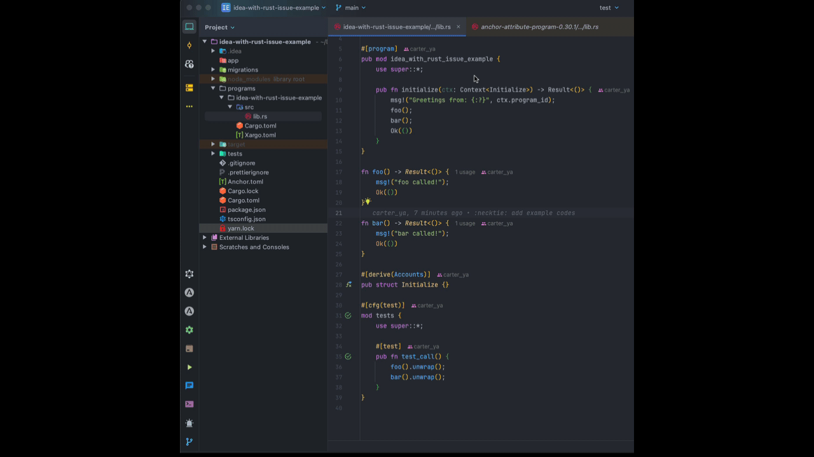

### Issue: Rust Plugin Fails to Resolve Symbol References Correctly

#### Description

The Rust plugin in IntelliJ IDEA fails to correctly resolve symbol references under certain conditions. This issue is
demonstrated in the attached `issue.gif` file.

#### Steps to Reproduce

1. Open the project in IntelliJ IDEA.
2. Navigate to the [lib.rs](./programs/idea-with-rust-issue-example/src/lib.rs).
3. Observe the symbol references as shown in the `issue.gif`.

#### Expected Behavior

The Rust plugin should correctly resolve and highlight symbol references.

#### Actual Behavior

The Rust plugin fails to resolve the symbol references, leading to incorrect highlighting and potential errors in code
navigation.

#### Environment

- **IDE**: IntelliJ IDEA 2024.2.4
- **Rust Plugin Version**: 242.23726.110
- **Operating System**: macOS
- **Build Tools**: Cargo, Anchor, Solana

#### Additional Information

Please refer to the attached `issue.gif` for a visual representation of the problem.

